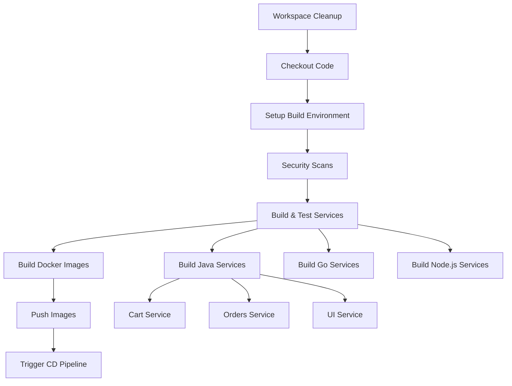

# CI/CD Pipeline Fix Design Document

## Overview

The current Jenkins pipeline fails because it attempts to build Docker images without first compiling and packaging the underlying applications. The microservices architecture includes:

- **Java/Maven services**: cart, orders, ui (Spring Boot applications)
- **Go service**: catalog (Gin-based API)
- **Node.js service**: checkout (NestJS application)

The pipeline needs to be restructured to handle multi-language builds, proper dependency management, missing configuration files, and build orchestration.

## Architecture

### Current Pipeline Issues

1. **Missing Build Steps**: Docker builds fail because source code isn't compiled
2. **Missing Checkstyle Config**: Maven builds reference non-existent `../misc/style/java/checkstyle.xml`
3. **Maven Wrapper Permissions**: `mvnw` files may lack execute permissions
4. **No Test Execution**: Tests aren't run before building images
5. **Build Order**: Services aren't built in dependency order

### Proposed Pipeline Architecture



## Components and Interfaces

### 1. Build Environment Setup Stage

**Purpose**: Configure build tools and resolve permission issues

**Components**:
- Java/Maven environment validation
- Go environment setup
- Node.js environment setup
- Maven wrapper permission fixes
- Checkstyle configuration handling

### 2. Service Build Orchestrator

**Purpose**: Build services in correct order with proper error handling

**Components**:
- **Maven Build Handler**: Handles Java services with proper lifecycle
- **Go Build Handler**: Compiles Go services with dependency management
- **Node.js Build Handler**: Handles npm/yarn builds and tests
- **Build Order Manager**: Ensures correct build sequence

### 3. Test Execution Framework

**Purpose**: Run comprehensive tests before Docker builds

**Components**:
- **Unit Test Runner**: Executes service-specific unit tests
- **Integration Test Runner**: Runs integration tests where available
- **Test Report Aggregator**: Collects and reports test results

### 4. Docker Build Manager

**Purpose**: Build Docker images only after successful compilation

**Components**:
- **Image Builder**: Creates Docker images with compiled artifacts
- **Multi-stage Build Handler**: Optimizes Docker builds for each service type
- **Image Tagging Strategy**: Consistent tagging and versioning

## Data Models

### Build Configuration

```yaml
services:
  java_services:
    - name: "cart"
      path: "./src/cart"
      type: "maven"
      java_version: "21"
      skip_checkstyle: true
    - name: "orders"
      path: "./src/orders"
      type: "maven"
      java_version: "21"
      skip_checkstyle: true
    - name: "ui"
      path: "./src/ui"
      type: "maven"
      java_version: "21"
      skip_checkstyle: true
  
  go_services:
    - name: "catalog"
      path: "./src/catalog"
      type: "go"
      go_version: "1.23"
  
  nodejs_services:
    - name: "checkout"
      path: "./src/checkout"
      type: "nodejs"
      package_manager: "npm"
```

### Build Status Model

```yaml
build_status:
  service_name: string
  build_stage: enum [setup, compile, test, docker_build, push]
  status: enum [pending, running, success, failed]
  error_message: string
  duration: number
  artifacts: list[string]
```

## Error Handling

### 1. Maven Build Failures

**Strategy**: Graceful degradation with detailed logging

- **Missing Checkstyle**: Skip checkstyle validation with warning
- **Dependency Issues**: Retry with clean install and dependency resolution
- **Compilation Errors**: Capture full Maven output and highlight errors
- **Test Failures**: Report specific test failures and continue with other services

### 2. Permission Issues

**Strategy**: Proactive permission management

- **Maven Wrapper**: Ensure execute permissions before build
- **File System**: Validate write permissions for build outputs
- **Docker Socket**: Verify Docker daemon accessibility

### 3. Build Order Dependencies

**Strategy**: Dependency-aware build orchestration

- **OpenAPI Dependencies**: Build services with OpenAPI specs before UI service
- **Shared Libraries**: Handle any shared dependencies between services
- **Parallel Builds**: Build independent services in parallel for efficiency

## Testing Strategy

### 1. Unit Testing

**Maven Services**:
```bash
./mvnw clean test -Dcheckstyle.skip=true
```

**Go Services**:
```bash
go test ./... -v
```

**Node.js Services**:
```bash
npm test
```

### 2. Integration Testing

**Maven Services**:
```bash
./mvnw verify -Dcheckstyle.skip=true
```

**Testcontainers**: Ensure Docker is available for integration tests

### 3. Build Validation

**Artifact Verification**:
- Verify JAR files are created for Maven services
- Verify Go binaries are compiled
- Verify Node.js dist folders are created

## Implementation Phases

### Phase 1: Environment Setup and Configuration

1. **Create missing checkstyle configuration or skip validation**
2. **Fix Maven wrapper permissions**
3. **Validate build tool availability**
4. **Configure proper Java version (21)**

### Phase 2: Service Build Implementation

1. **Implement Maven build with proper lifecycle**
2. **Add Go build with dependency management**
3. **Add Node.js build with package management**
4. **Implement parallel builds for independent services**

### Phase 3: Test Integration

1. **Add unit test execution for all services**
2. **Implement test result aggregation**
3. **Add integration test support**
4. **Configure test failure handling**

### Phase 4: Docker Build Enhancement

1. **Modify Docker builds to use compiled artifacts**
2. **Implement multi-stage Docker builds**
3. **Add build caching strategies**
4. **Optimize image sizes**

### Phase 5: Error Handling and Monitoring

1. **Implement comprehensive error logging**
2. **Add build status reporting**
3. **Configure failure notifications**
4. **Add build metrics collection**

## Security Considerations

### 1. Dependency Scanning

- **Maven Dependencies**: Use OWASP dependency check on compiled artifacts
- **Go Dependencies**: Scan go.mod for vulnerabilities
- **Node.js Dependencies**: Use npm audit or yarn audit

### 2. Build Security

- **Isolated Builds**: Ensure builds don't interfere with each other
- **Credential Management**: Secure handling of Docker registry credentials
- **Artifact Integrity**: Verify build artifacts before Docker image creation

## Performance Optimizations

### 1. Build Caching

- **Maven Local Repository**: Cache Maven dependencies
- **Go Module Cache**: Cache Go modules
- **Node.js Cache**: Cache node_modules
- **Docker Layer Caching**: Optimize Docker build layers

### 2. Parallel Execution

- **Independent Services**: Build cart, orders, catalog in parallel
- **Test Parallelization**: Run tests concurrently where possible
- **Docker Builds**: Parallel Docker image creation

### 3. Resource Management

- **Memory Allocation**: Proper JVM heap settings for Maven builds
- **CPU Utilization**: Optimize parallel job count
- **Disk Space**: Clean up intermediate build artifacts